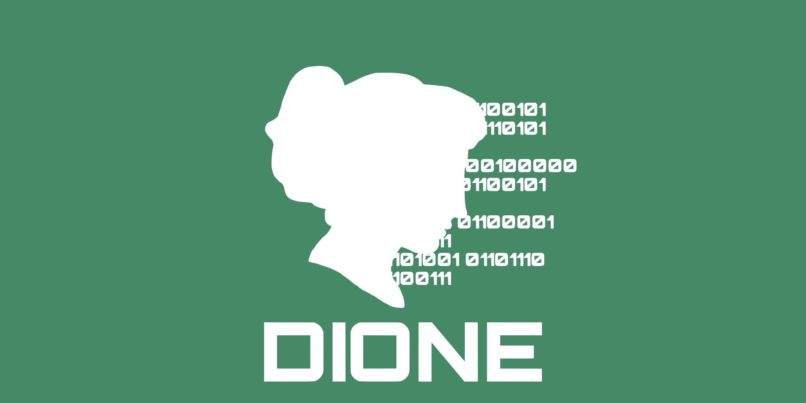

[](https://github.com/Dione-Software/dione/issues)
[](https://github.com/Dione-Software/dione/actions/workflows/rust.yml)
[](https://github.com/Dione-Software/dione/actions/workflows/docker.yml)
[](https://github.com/Dione-Software/dione/releases)


## Secure and Anonymous Messaging
__WARNING:__ Currently Dione is not ready to be used nor does it fulfill its goal of being an anonymous messenger.
In order to achieve that every client's traffic and maybe every node's traffic hast to be routed through an Onion Router.

At the present moment the following anonymization networks are considered for integration.
However, first other issues have to be resolved and none of these services have currently a stable, native and usable Rust client.

| Service | Favoured Client |
|---------|-----------------|
| [Tor](https://www.torproject.org) | [Arti](https://gitlab.torproject.org/tpo/core/arti)|
| I2P     | [I2p-rs](https://github.com/i2p/i2p-rs) (could be deprecated) |
| Lokinet | (none)          |


## What is Dione?

Dione is the attempt to build a messaging application that is as censorship resistant as possible.
This is achieved by not relying on a single entity for storing and distributing messages.
Instead, every message is split up into several parts and stored on several servers (nodes). These servers are only known
to sender and receiver. This is achieved by a simplified Double Ratchet (Address Ratchet). In the background
the Dione servers are connected via [libp2p](https://libp2p.io). [Kademlia](https://en.wikipedia.org/wiki/Kademlia) is utilized to find servers for the Address Ratchets
Output and to find providers for message parts.

#### A more detailed description will follow. In the process of standardizing and improving of Dione breaking changes are very likely

## Try out Dione yourself

There is a docker image, but this is still under heavy development and not suggested at the present moment.

Currently, there is no Dione main-net that one can just join. For now, you have to set up a test-net yourself.

### Install
To install the server as well as the test client you need to have an up-to-date installation of Rust.
To update Rust, run:

```rustup update```

Next you have to clone this repository and enter it. Then run the following command, to install the server as well as the test-client:

```cargo install --path .```

Alternatively you can run the executables shipped with the release.

### Run Nodes

For reasons not fixed yet the application is not stable enough to run on a permanent net. For a net test net you need at least two peers
that have to be able to connect to each other.

The server application has many optional arguments one can pass. For now we run the nodes in two terminals on the same computer. For starters just run the following:

`dione-server --db-path node1 --ex 0.0.0.0:8010 --clear-address http://localhost:8010 --listen-address /ip4/0.0.0.0/tcp/0`

Next open your browser and navigate to: `localhost:8080` Copy the peer address starting with `/ip4/127.0.0.1/tcp/`.
This is the libp2p address of the first node which the second node connects to. This address has to be set as the environment variable for remote peer with (**run in new terminal window**):

`export PEER=address copied previous`

Next start the second nodes with different parameters:

`dione-server --db-path node2 --ex 0.0.0.0:8011 --clear-address http://localhost:8011 --listen-address /ip4/0.0.0.0/tcp/0 --web-http-port 8100`

Up next: Sending messages!

### Run Client

Open a new terminal (we call this terminal `client-1`). Run the test client in it with:

`dione-test-client client1 --server http://localhost:8010`

Open another terminal (we call this terminal `client-2`). Run the second client in it:

`dione-test-client client2 --server http://localhost:8011`

In terminal window `client-2` one can see an Uuid, probably looking _like_ this: `d75258f6-b3b9-4639-87a5-055c5fcf9155` Copy this to your clipboard.

Change to `client-1`, select `Add User`. In the next step paste the previously copied Uuid. Select `Initiate contact` next. Accept the next step.

Copy the Uuid from `client-1`.

Change to `client-2`, select `Add User`. In the next step paste the previously copied Uuid. Select `React on invitation` next. Accept the next question.
Change to `client-1` and accept.
Change to `client-2` and accept again.

You can send and receive messages now.

Use the both terminal windows to send and recieve messages. The menu should be self-explanatory. Obviously a message has to be send, in order to receive one.

## Contribute

There's a lot to do:
- [ ] Fix a lot of bugs!
- [ ] Custom libp2p transport
- [ ] Slim `dione-lib`
- [ ] Audit `dione-lib`
- [ ] Better error handling and better recovery
- [ ] Check of libp2p part by an expert. Many issues probably start here.
- [ ] Document everything better
- [ ] Make messages universally usable from more language (essentially remove [bincode](https://github.com/servo/bincode))
- [ ] Implement `dione-net-lib` and `dione-lib` in App languages ([Swift](https://swift.org) / [Kotlin](https://kotlinlang.org) / [Dart](https://dart.dev))
- [ ] Program end-user-friendly app

If you want to contribute feel free to fork the repository, document your changes and create a pull request.
